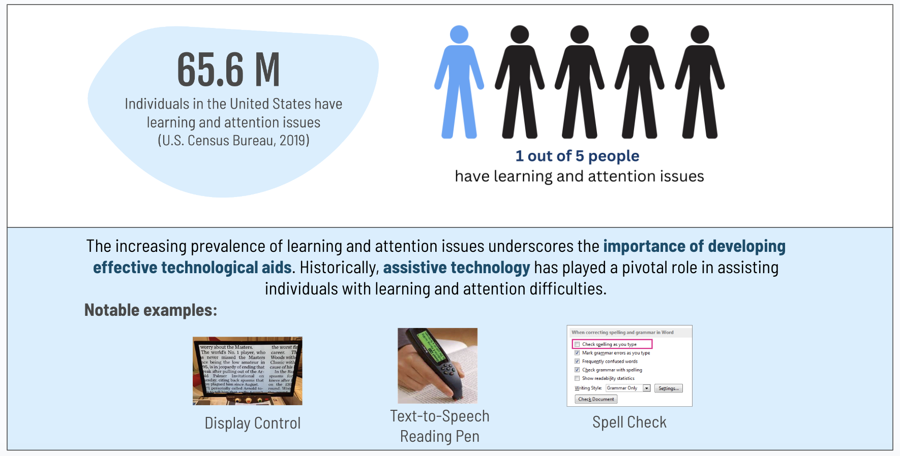
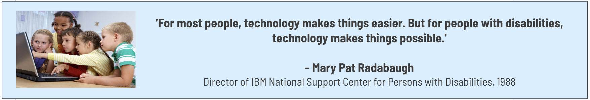
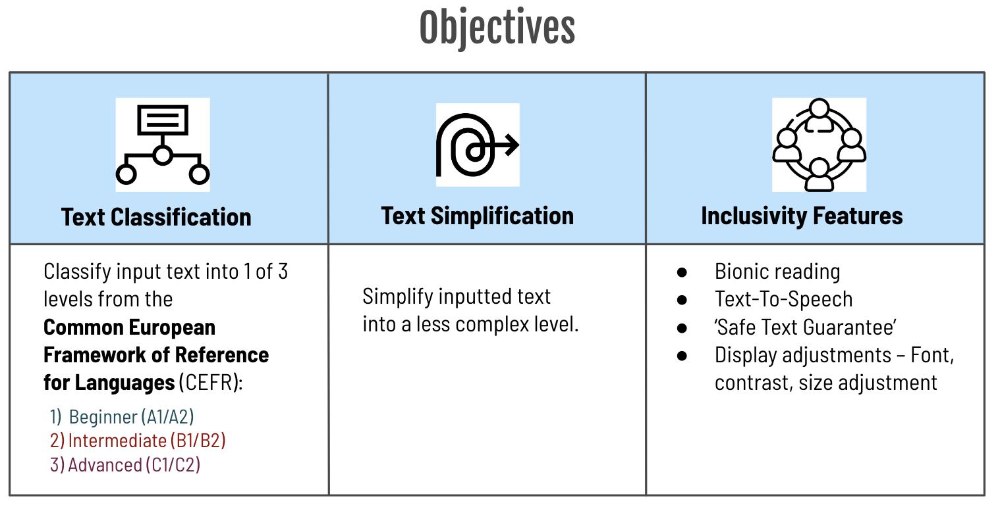
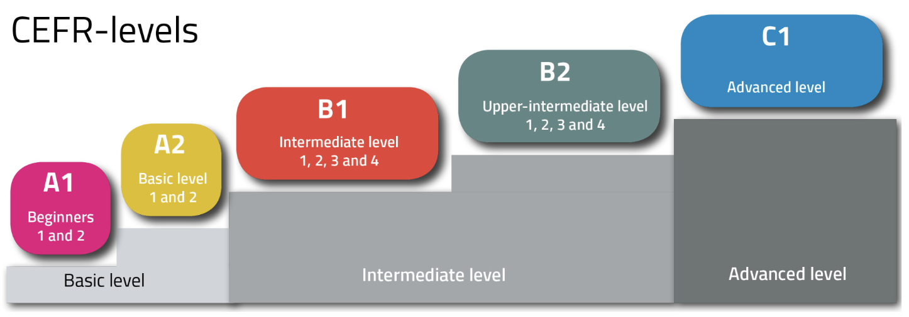
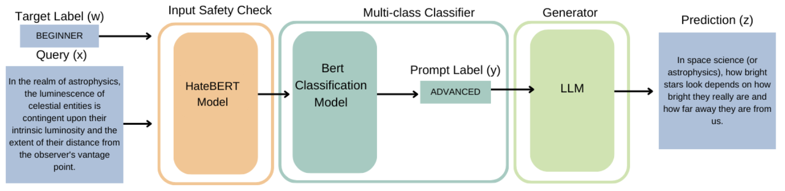
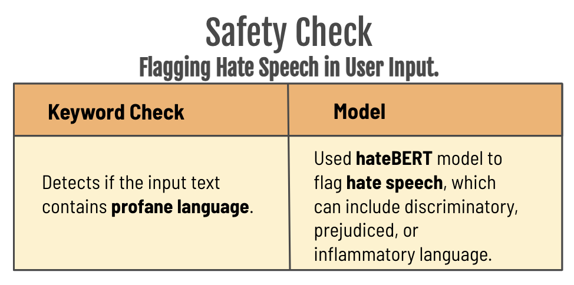
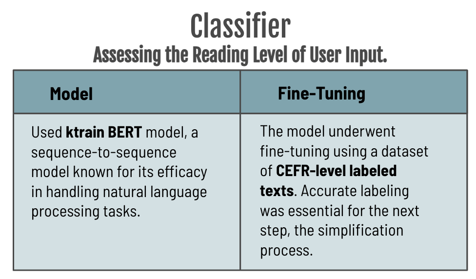
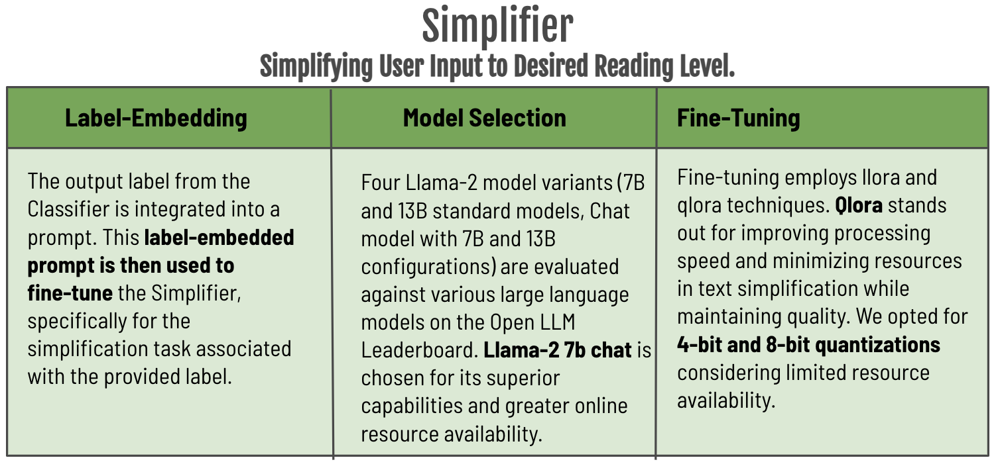

  Keep it Simple is an AI tool designed to simplify text into a more readable, understandable, and visually accessible format. Made for everyone, whether you’re new to English, a young learner, or someone who faces challenges with reading due to learning issues.

---
<h2 align=“center”>Motivation behind Creating an Assistive Technology</h1>

  

  Building upon the insights gained from these technological advancements, we have developed an AI-driven solution.   
  The goal is to create a tool that not only assists in overcoming the challenges posed by learning and attention issues but also enhances the overall learning experience for all users.   
  

  

  We aim to make the digital realm more inclusive and information more easily digestible.  

---
## Table of Contents
1. [Our Goals](#our-goals)
2. [Data](#data-with-readability-levels)
3. [Model](#our-ai-model-safety-check-%2B-classifier-%2B-simplifier)
4. [Model Evaluation](#model-evaluation) 
5. [User Interface](#user-interface) 
6. [Findings](#findings)
7. [How to Use](#how-to-use)
8. [About Us](#about-us)

---
## Our Goals {#our-goals}

  

---

## Data with Readability Levels {#data-with-readability-levels}

We collected open source articles from '[News in Levels](https://www.newsinlevels.com/)' and 'Wikipedia'/ '[Simple Wikipedia](https://simple.wikipedia.org/wiki/),' as well as text from '[OneStopEnglish](https://github.com/nishkalavallabhi/OneStopEnglishCorpus)' research dataset. 

These sources have the same text in multiple reading levels, which we define with the [Common European Framework of Reference for Languages (CEFR)](https://www.coe.int/en/web/common-european-framework-reference-languages/level-descriptions).

There are 6 CEFR levels, but we mapped our data to 3 major levels: CEFR C-B-A corresponding to Advanced-Intermediate-Beginner.

  

---

## Our AI Model Safety Check + Classifier + Simplifier {#our-ai-model-safety-check-%2B-classifier-%2B-simplifier}

Our model first classifies texts into the predefined CEFR levels and then simplifies the content to match the desired reading level. We also flag if a text has Unsafe Text, including profane language and hate speech.

  
  

  

## Model Evaluation {#model-evaluation}
For the robust evaluation of the tool’s performance, we’ve incorporated several methods:
1. **CEFR (Common European Framework of Reference for Languages)**: A readability index, trained on a dataset sourced from Kaggle. Using this, we generate labels for the produced text and juxtapose it against the ground truth from our evaluation set.
2. **SMOG (Simple Measure of Gobbledygook)**: Assesses the years of education required to comprehend a piece of writing.
3. **Flesch Reading Ease Score**: A test that rates text on a 100-point scale; the higher the score, the easier it is to understand the document.
4. **Additional Indices**: Incorporation of other readability indices to comprehensively gauge the model’s capability in conditional text simplification.

#### GPT-4 as a Judge of Model Responses

|      Model       | CEFR Accuracy |     SMOG     | Flesch Reading Ease |      GPT-4 Judge    |
| :--------------: | :-----------: | :----------: | :-----------------: | :-----------------: |
| Llama-2-7b       | VAL1          |              |                     |                     |
| Llama-2-13b      | VAL2          |              |                     |                     |
| Llama-2-7b-chat  | VAL2          |              |                     |                     |
| Llama-2-13b-chat | VAL2          |              |                     |                     |
| Mistral-7b       | VAL2          |              |                     |                     |

## User Interface {#user-interface}

Accessibility Features:

## Findings {#findings}

## How to Use {#how-to-use}

1. Access the tool via our web portal.
2. Paste or type in the content you wish to simplify.
3. Select the desired readability level.
4. Adjust display and format. 
5. View the simplified content.
6. (Optional) Provide feedback for continuous model improvement.

**Getting Started for Developers:**
1. Clone the GitHub repository.
2. Ensure all dependencies are installed.
3. For local testing, run the Streamlit app.
4. For deploying on your server, modify the necessary configuration settings.

## About Us {#about-us}

Team: 
- Ankita Nambiar
- Egehan Yorulmaz
- Lavanya Srivastava
- Prayut Jain

Conversation AI with Nick Kadochnikov @ University of Chicago M.S. in Applied Data Science 

Contributions, feedback, and improvements are always welcome. Feel free to submit pull requests or raise issues.
This project is licensed under the MIT License. Refer to the `LICENSE` file for more details.

                                    Keep It Simple. Making Information Accessible with AI. 
